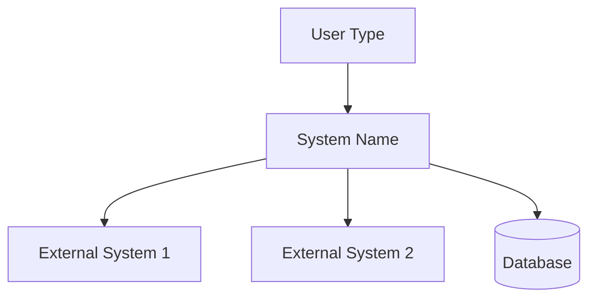
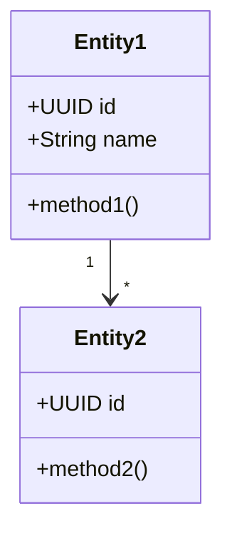
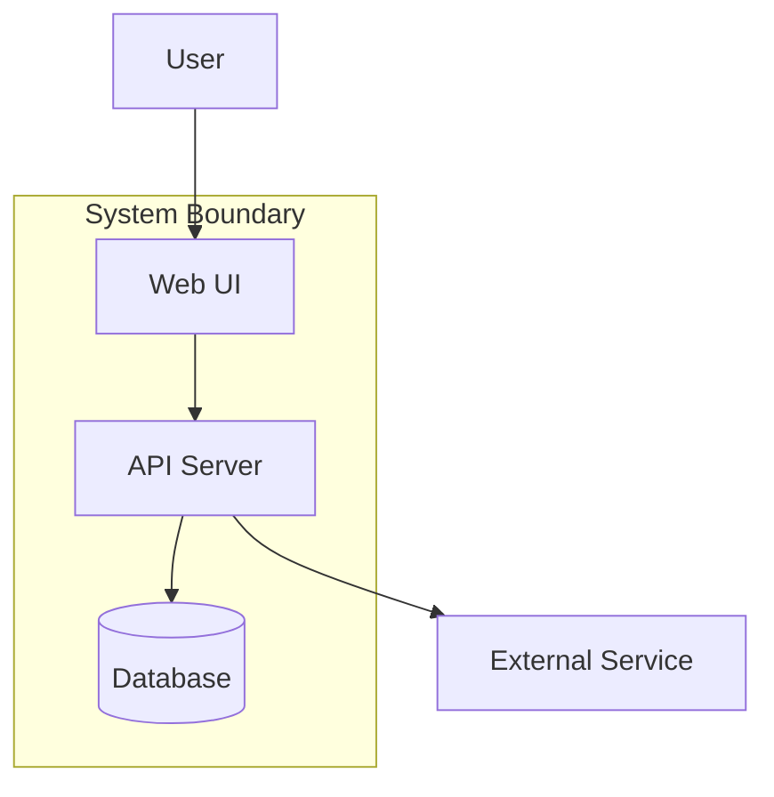
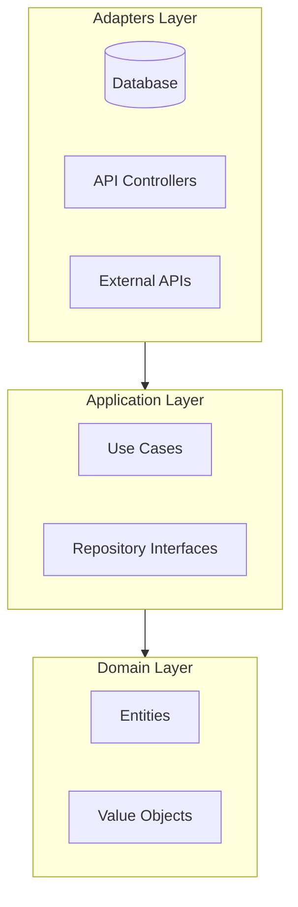
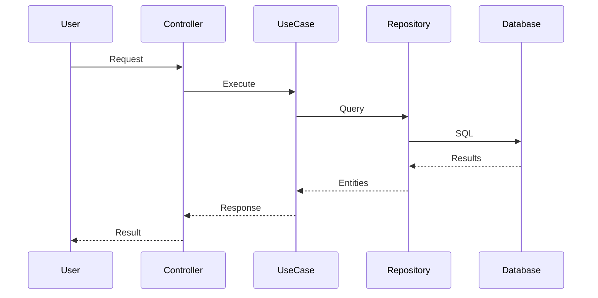

# [System Name] Architecture Document

**Version:** 1.0
**Date:** [Date]
**Status:** [Draft | Approved]

---

## 1. Introduction

### Purpose

[What is this system and why does it exist?]

### Scope

[What is covered by this architecture document?]

### Stakeholders

| Role | Concern |
|------|---------|
| [Role 1] | [What they care about] |
| [Role 2] | [What they care about] |

---

## 2. System Context

### Context Diagram (C4 Level 1)



### External Interfaces

| System | Integration | Protocol |
|--------|-------------|----------|
| [External 1] | [Purpose] | [REST/gRPC/etc] |
| [External 2] | [Purpose] | [REST/gRPC/etc] |

---

## 3. Domain Model

### Entities

| Entity | Description | Key Attributes |
|--------|-------------|----------------|
| [Entity 1] | [Purpose in domain] | [Key attributes] |
| [Entity 2] | [Purpose in domain] | [Key attributes] |

### Value Objects

| Value Object | Encapsulates | Validation Rules |
|--------------|--------------|------------------|
| [VO 1] | [What it represents] | [Constraints] |
| [VO 2] | [What it represents] | [Constraints] |

### Aggregates

| Aggregate | Root Entity | Contains |
|-----------|-------------|----------|
| [Aggregate 1] | [Root] | [Nested entities, value objects] |
| [Aggregate 2] | [Root] | [Nested entities, value objects] |

### Domain Services

| Service | Purpose | Entities Involved |
|---------|---------|-------------------|
| [Service 1] | [What it does] | [Which entities] |

### Domain Model Diagram



---

## 4. Architecture Layers

### Container Diagram (C4 Level 2)



### Domain Layer (Innermost)

**Contains:** Entities, Value Objects, Domain Services

**Dependencies:** None (pure business logic)

**Responsibilities:**
- Core business rules
- Domain validation
- Business calculations

### Application Layer

**Contains:** Use Cases, Repository Interfaces

**Dependencies:** Domain Layer only

**Responsibilities:**
- Orchestrate domain objects
- Define interfaces for adapters
- Application-specific validation

### Adapters Layer (Outermost)

**Contains:** Repository Implementations, API Controllers, UI

**Dependencies:** Application + Domain Layers

**Responsibilities:**
- Implement repository interfaces
- Handle HTTP/API concerns
- Database operations

### Dependency Rule



---

## 5. Key Interfaces

### Repository Interfaces

**[Entity]Repository:**
```python
class [Entity]Repository(Protocol):
    def find_by_id(self, id: UUID) -> [Entity] | None: ...
    def search(self, criteria: SearchCriteria) -> list[[Entity]]: ...
    def save(self, entity: [Entity]) -> None: ...
    def delete(self, id: UUID) -> None: ...
```

### Use Case Interfaces

**[UseCase]:**
```python
@dataclass
class [UseCase]Input:
    # Input fields

@dataclass
class [UseCase]Output:
    # Output fields
```

---

## 6. Data Flow

### Primary Use Case: [Name]



---

## 7. Quality Attributes

| Attribute | Requirement | Architecture Decision |
|-----------|-------------|----------------------|
| Testability | [Target] | [How achieved] |
| Performance | [Target] | [How achieved] |
| Modifiability | [Target] | [How achieved] |
| Security | [Target] | [How achieved] |
| Scalability | [Target] | [How achieved] |

---

## 8. Constraints

### Technical Constraints

- [Constraint 1]
- [Constraint 2]

### Organizational Constraints

- [Constraint 1]
- [Constraint 2]

### External Constraints

- [Constraint 1]
- [Constraint 2]

---

## 9. Architecture Decisions

| ADR | Decision | Status | Date |
|-----|----------|--------|------|
| 001 | [Major decision 1] | Accepted | [Date] |
| 002 | [Major decision 2] | Accepted | [Date] |

See `docs/adr/` for detailed decision records.

---

## 10. Risks and Technical Debt

### Risks

| Risk | Impact | Mitigation |
|------|--------|------------|
| [Risk 1] | [Impact level] | [Mitigation strategy] |
| [Risk 2] | [Impact level] | [Mitigation strategy] |

### Known Technical Debt

- [ ] [Technical debt item 1]
- [ ] [Technical debt item 2]

---

## 11. Glossary

| Term | Definition |
|------|------------|
| [Term 1] | [Definition] |
| [Term 2] | [Definition] |

---

## 12. References

- [Requirements document]
- [Business case]
- [Related architecture documents]
