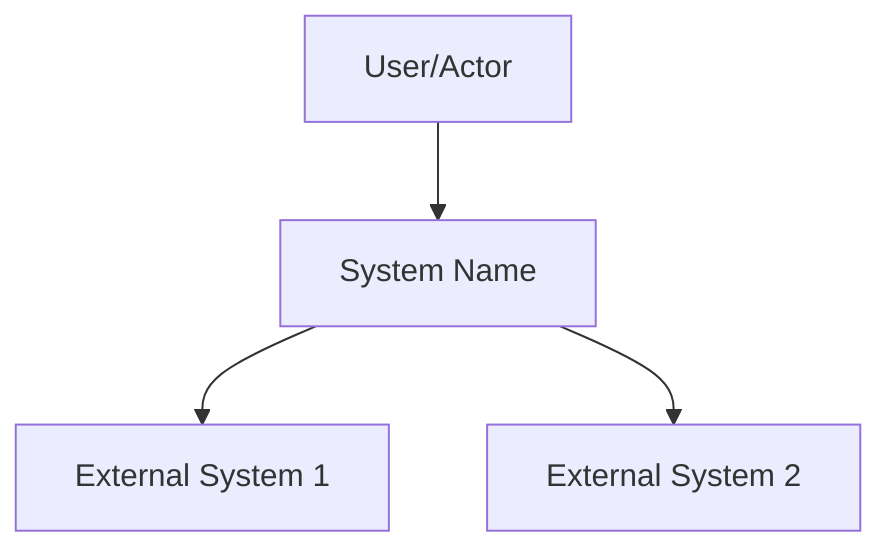

# [System Name] Design Document

**Author:** [Name/Role]
**Date:** [Date]
**Status:** [Draft | In Review | Approved]

---

## 1. Overview

[2-3 paragraph summary of what this system does, who uses it, and what problem it solves.]

---

## 2. Goals and Non-Goals

### Goals

- [Goal 1: Specific, verifiable capability]
- [Goal 2: Specific, verifiable capability]
- [Goal 3: Specific, verifiable capability]

### Non-Goals (Explicitly Out of Scope)

- [Non-goal 1] — [Brief rationale why explicitly excluded]
- [Non-goal 2] — [Brief rationale why explicitly excluded]
- [Non-goal 3] — [Brief rationale why explicitly excluded]

---

## 3. Context

### System Context Diagram

### Background

[Describe the environment this system operates in. Who uses it? What does it integrate with? What's the current state?]

---

## 4. Design Overview

### High-Level Approach

[1-2 paragraphs describing the overall approach. Not detailed architecture—high-level strategy.]

### Major Components

| Component | Purpose |
|-----------|---------|
| [Component 1] | [Brief purpose] |
| [Component 2] | [Brief purpose] |
| [Component 3] | [Brief purpose] |

### Key APIs/Interfaces

[Sketch of main interfaces—not full specification, just enough to understand the approach.]

### Data Storage

[Brief description of data storage approach—not schema, just strategy.]

---

## 5. Alternatives Considered

### Alternative 1: [Name]

**Decision:** We will use [chosen approach].

**Options Considered:**
1. **[Option A]:** [Brief description]
   - Rejected because: [Reason]
2. **[Option B]:** [Brief description]
   - Rejected because: [Reason]

**Why we chose this approach:** [Rationale]

### Alternative 2: [Name]

**Decision:** We will use [chosen approach].

**Options Considered:**
1. **[Option A]:** [Brief description]
   - Rejected because: [Reason]
2. **[Option B]:** [Brief description]
   - Rejected because: [Reason]

**Why we chose this approach:** [Rationale]

---

## 6. Cross-Cutting Concerns

### Security

[How security is addressed—authentication, authorization, data protection.]

### Privacy

[Privacy considerations—data handling, user consent, retention.]

### Monitoring & Observability

[How the system will be monitored—logging, metrics, alerting.]

### Error Handling

[Error handling strategy—how errors are captured, reported, recovered.]

---

## 7. Open Questions

- [ ] [Question 1 that needs resolution]
- [ ] [Question 2 that needs resolution]
- [ ] [Question 3 that needs resolution]

---

## 8. References

- [Link to requirements document]
- [Link to related design docs]
- [Link to relevant technical documentation]

---

**Next Steps:**
- [ ] [Action item 1]
- [ ] [Action item 2]
- [ ] [Action item 3]
