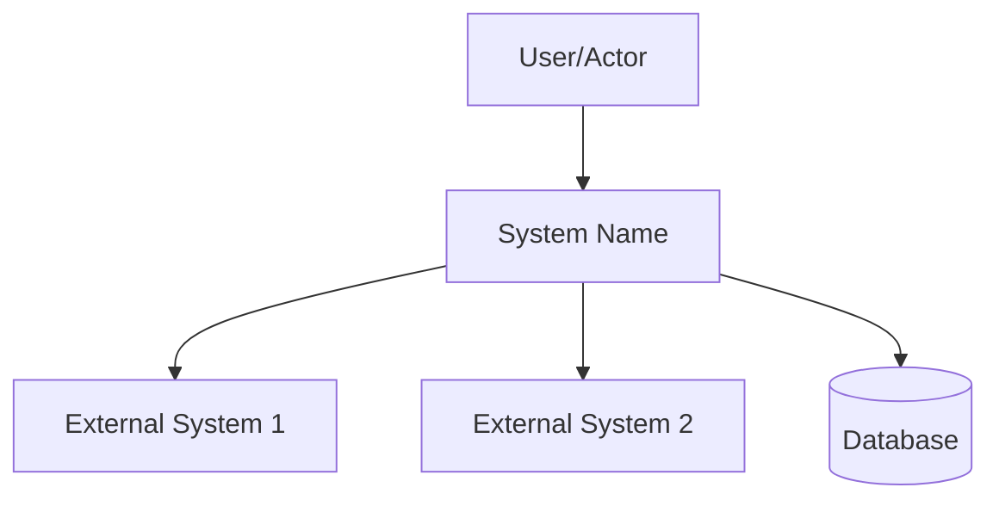
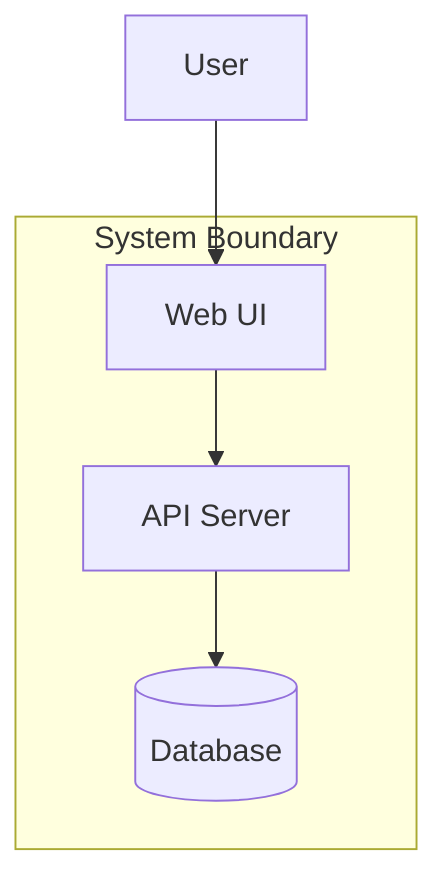
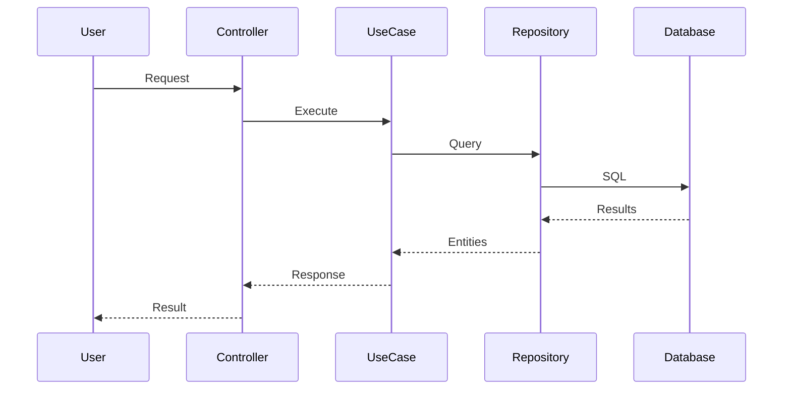

# [System Name] Design & Architecture Document

**Version:** 1.0
**Author:** [Name/Role]
**Date:** [Date]
**Status:** [Draft | In Review | Approved]

---

## Part I: Design Context

### 1. Overview

[2-3 paragraph summary of what this system does, who uses it, and what problem it solves. This sets the stage for both decisions and architecture.]

---

### 2. Goals and Non-Goals

#### Goals

- [Goal 1: Specific, verifiable capability]
- [Goal 2: Specific, verifiable capability]
- [Goal 3: Specific, verifiable capability]
- [Goal 4: Specific, verifiable capability]

#### Non-Goals (Explicitly Out of Scope)

- [Non-goal 1] — [Brief rationale]
- [Non-goal 2] — [Brief rationale]
- [Non-goal 3] — [Brief rationale]

---

### 3. System Context

#### Context Diagram (C4 Level 1)



#### External Interfaces

| System | Integration | Protocol |
|--------|-------------|----------|
| [External 1] | [Purpose] | [REST/etc] |
| [External 2] | [Purpose] | [REST/etc] |

#### Background

[What's the environment? Current state? Key stakeholders?]

---

## Part II: Architecture

### 4. Domain Model

#### Entities

| Entity | Description | Key Attributes |
|--------|-------------|----------------|
| [Entity 1] | [Purpose] | [Attributes] |
| [Entity 2] | [Purpose] | [Attributes] |

#### Value Objects

| Value Object | Encapsulates | Validation |
|--------------|--------------|------------|
| [VO 1] | [What] | [Rules] |
| [VO 2] | [What] | [Rules] |

#### Aggregates

| Aggregate | Root Entity | Contains |
|-----------|-------------|----------|
| [Agg 1] | [Root] | [Components] |
| [Agg 2] | [Root] | [Components] |

#### Domain Services

| Service | Purpose | Entities Involved |
|---------|---------|-------------------|
| [Service] | [What it does] | [Entities] |

---

### 5. Architecture Layers

#### Container Diagram (C4 Level 2)



#### Layer Definitions

**Domain Layer (Innermost)**
- Contains: Entities, Value Objects, Domain Services
- Dependencies: None (pure business logic)

**Application Layer**
- Contains: Use Cases, Repository Interfaces
- Dependencies: Domain Layer only

**Adapters Layer (Outermost)**
- Contains: Implementations, Controllers, UI
- Dependencies: Application + Domain Layers

#### Dependency Rule

All dependencies point INWARD. Outer layers implement interfaces defined by inner layers.

---

### 6. Key Interfaces

#### Repository Interfaces

```python
class [Entity]Repository(Protocol):
    def find_by_id(self, id: UUID) -> [Entity] | None: ...
    def save(self, entity: [Entity]) -> None: ...
    def delete(self, id: UUID) -> None: ...
```

#### Use Case Interfaces

```python
@dataclass
class [UseCase]Input:
    # Input fields

@dataclass
class [UseCase]Output:
    # Output fields
```

---

### 7. Data Flow



---

## Part III: Decisions & Quality

### 8. Alternatives Considered

#### Decision 1: [Topic]

**Chosen:** [Approach selected]

**Alternatives:**
1. **[Alt A]:** [Description] — Rejected: [Reason]
2. **[Alt B]:** [Description] — Rejected: [Reason]

**Rationale:** [Why we chose this approach]

#### Decision 2: [Topic]

**Chosen:** [Approach selected]

**Alternatives:**
1. **[Alt A]:** [Description] — Rejected: [Reason]
2. **[Alt B]:** [Description] — Rejected: [Reason]

**Rationale:** [Why we chose this approach]

---

### 9. Quality Attributes

| Attribute | Requirement | Architecture Decision |
|-----------|-------------|----------------------|
| Testability | [Target] | [How achieved] |
| Performance | [Target] | [How achieved] |
| Modifiability | [Target] | [How achieved] |
| Security | [Target] | [How achieved] |

---

### 10. Cross-Cutting Concerns

#### Security
[Authentication, authorization, data protection approach]

#### Error Handling
[How errors are captured, reported, recovered]

#### Monitoring
[Logging, metrics, alerting strategy]

---

### 11. Constraints

**Technical:**
- [Constraint 1]
- [Constraint 2]

**Organizational:**
- [Constraint 1]
- [Constraint 2]

---

### 12. Risks

| Risk | Impact | Mitigation |
|------|--------|------------|
| [Risk 1] | [Level] | [Strategy] |
| [Risk 2] | [Level] | [Strategy] |

---

## Part IV: Reference

### 13. Architecture Decision Records

| ADR | Decision | Status |
|-----|----------|--------|
| 001 | [Decision 1] | Accepted |
| 002 | [Decision 2] | Accepted |
| 003 | [Decision 3] | Proposed |

---

### 14. Glossary

| Term | Definition |
|------|------------|
| [Term 1] | [Definition] |
| [Term 2] | [Definition] |

---

### 15. References

- [Requirements document]
- [Business case]
- [User stories]
- [Related documentation]

---

## Next Steps

- [ ] [Review with stakeholders]
- [ ] [Finalize ADRs]
- [ ] [Begin implementation]
