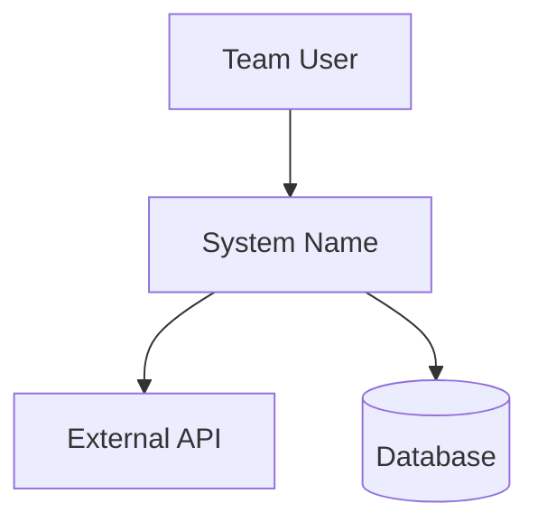

# Workflow: Create Design Document (Lightweight)

<required_reading>
**Read these reference files NOW:**
1. references/methodology.md — Google Design Docs structure, Goals/Non-Goals pattern
2. templates/design-doc-template.md — Output template to fill
</required_reading>

<context>
A Design Document (Google style) is a **decision-focused** document written before implementation. It captures:
- **What** you're building and **why**
- **What you're NOT** building (equally important)
- **Alternatives considered** and why they were rejected
- **Key decisions** with rationale

It is NOT a comprehensive architecture spec. Keep it 10-20 pages.
</context>

<process>

## Phase 1: Analyze Input Files

1. Read all provided input files
2. Extract from user stories:
   - Primary actors (from "As a [role]" patterns)
   - Key capabilities (from "I want to" patterns)
   - Success conditions (from acceptance criteria)
3. Extract from requirements (if provided):
   - Functional requirements → Goals candidates
   - Non-functional requirements → Constraints and quality attributes
4. Extract from business case (if provided):
   - Stakeholders and their concerns
   - Business constraints
   - Success metrics

## Phase 2: Define Goals and Non-Goals

**This is the most important section of a design doc.**

1. Draft 3-7 **Goals** from requirements:
   - Each goal is a concrete capability or outcome
   - Goals should be verifiable (not vague)
   - Use active voice: "Support X", "Enable Y", "Provide Z"

2. Draft 3-5 **Non-Goals** explicitly:
   - Things that seem in-scope but intentionally aren't
   - Each non-goal needs brief rationale
   - This prevents scope creep

**Example pattern:**
```markdown
## Goals
- Support up to 10,000 influencers in the database
- Enable filtering by niche, platform, and engagement metrics
- Provide CSV export for brand presentations

## Non-Goals (Explicitly Out of Scope)
- Real-time social media sync (batch updates sufficient for MVP)
- Direct messaging to influencers (manual outreach via exported contacts)
- GDPR compliance for EU users (MENA region only for MVP)
```

## Phase 3: Context and Scope

1. Create a **System Context diagram** (C4 Level 1):
   - The system being built (center)
   - Users/actors interacting with it
   - External systems it integrates with

2. Write a brief narrative (2-3 paragraphs):
   - What is this system?
   - Who uses it?
   - What problem does it solve?

Use Mermaid for diagrams:


## Phase 4: Design Overview

1. Describe the **high-level approach** (1-2 paragraphs)
2. Identify major components/modules
3. Sketch key interfaces or APIs
4. Note data storage approach

**Keep it high-level** — detailed architecture belongs in the Architecture Document.

## Phase 5: Alternatives Considered

For 2-3 key decisions, document:
1. The decision that was made
2. Other options that were considered
3. Why the chosen approach won

**Format:**
```markdown
### Alternative: [Name]

**Decision:** We will use [chosen approach]

**Other options considered:**
1. **[Alternative A]**: [Brief description]
   - Rejected because: [Reason]
2. **[Alternative B]**: [Brief description]
   - Rejected because: [Reason]

**Why we chose [chosen approach]:** [Rationale]
```

## Phase 6: Cross-Cutting Concerns

Briefly address (1-2 sentences each unless more needed):
- Security considerations
- Privacy implications
- Monitoring/observability approach
- Error handling strategy

## Phase 7: Write Output

1. Read `templates/design-doc-template.md`
2. Fill in all sections with content from phases 2-6
3. Write to output location (same directory as primary input)
4. Filename: `DESIGN-DOC.md`

## Phase 8: Validate Output

Review the generated document against these checks:

1. **Placeholder check**: Search for `[` brackets — all `[placeholder]` text should be replaced with actual content
2. **Goals count**: Verify 3-7 goals exist (not fewer, not excessive)
3. **Non-Goals count**: Verify 3-5 non-goals exist with rationale for each
4. **Diagram validation**: Confirm Mermaid diagrams have valid syntax (no broken references)
5. **Alternatives documented**: At least 2 alternatives with rejection rationale
6. **Cross-references**: Requirements mentioned should trace back to input files

**If validation fails:**
- Return to the relevant phase and fix the issue
- Re-run validation after fixes
- Only mark complete when all checks pass

</process>

<success_criteria>
Design Document is complete when:
- [ ] Goals section has 3-7 concrete, verifiable goals
- [ ] Non-Goals section has 3-5 explicit exclusions with rationale
- [ ] System Context diagram shows users and external systems
- [ ] Design overview explains the high-level approach
- [ ] At least 2 alternatives considered are documented
- [ ] Cross-cutting concerns are addressed
- [ ] Document is 10-20 pages (not too long, not too short)
- [ ] Written to output location
</success_criteria>
