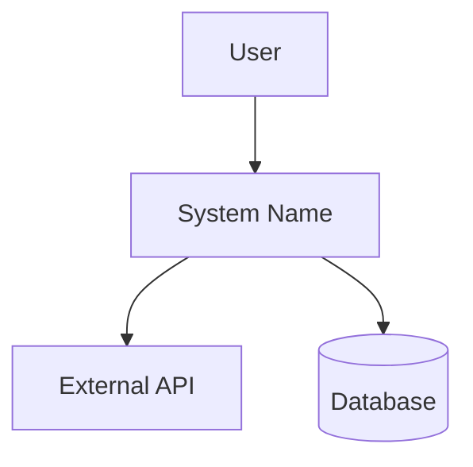
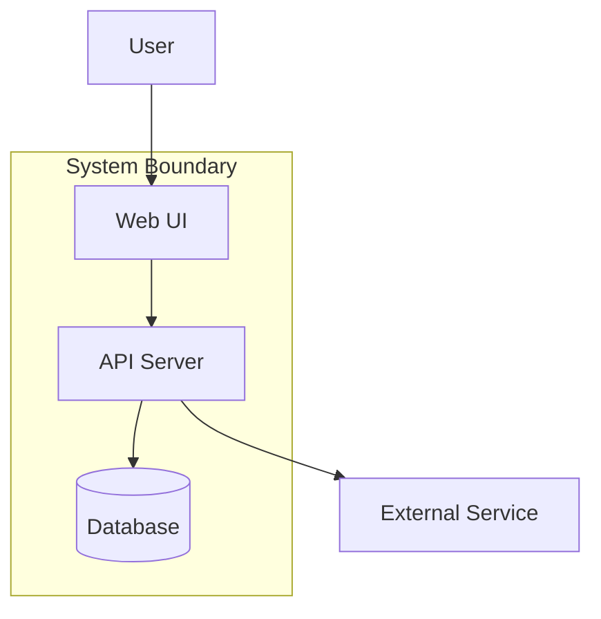

<overview>
This reference covers architecture documentation methodologies: Google Design Docs, C4 Model, arc42, and Architecture Decision Records (ADRs). These can be combined into a pragmatic approach for Agile teams.

## Contents
- Google Design Docs — Decision-focused documents, Goals/Non-Goals pattern
- C4 Model — Visual architecture at 4 zoom levels
- arc42 — Structured template with 12 optional sections
- ADRs — Capture single decisions with rationale
- Deployment View — Mapping containers to infrastructure nodes
- Cross-Cutting Concerns — System-wide architectural strategies
- Recommended Approach — Combining methodologies for Agile teams
</overview>

<google_design_docs>

**Purpose:** Decision-focused documents written BEFORE implementation.

**Core Sections:**

| Section | Purpose |
|---------|---------|
| **Context & Scope** | Background, what's being built |
| **Goals & Non-Goals** | What we're solving; what we're NOT |
| **Design Overview** | High-level approach, system context |
| **Detailed Design** | Trade-offs (not implementation details) |
| **Alternatives Considered** | Other designs evaluated, why rejected |
| **Cross-Cutting Concerns** | Security, privacy, monitoring |

**Key Characteristics:**
- 10-20 pages for larger projects; 1-3 for features
- Plain language, not UML-heavy
- Focuses on **trade-offs** over specification
- Living document, updated as design evolves

**Goals & Non-Goals Pattern:**

Goals state what you're building. Non-Goals explicitly state what you're NOT building—this prevents scope creep.

```markdown
## Goals
- Support up to 10,000 records
- Enable filtering by multiple criteria
- Provide export functionality

## Non-Goals (Explicitly Out of Scope)
- Real-time sync (batch updates sufficient)
- Advanced analytics (basic reporting only)
- Multi-tenant architecture (single tenant for MVP)
```

</google_design_docs>

<c4_model>

**Purpose:** Visual architecture communication at 4 zoom levels.

**Levels:**

| Level | Shows | When to Use |
|-------|-------|-------------|
| 1: System Context | How system fits in the world | Always |
| 2: Container | Major technical building blocks | Always |
| 3: Component | What's inside each container | Sometimes |
| 4: Code | Class diagrams | Rarely (code is truth) |

**Level 1 Example (Mermaid):**


**Level 2 Example (Mermaid):**


**Best Practice:** Most projects need only Levels 1-2. Level 3 is optional; Level 4 rarely useful.

</c4_model>

<arc42>

**Purpose:** Structured template with 12 optional sections for comprehensive documentation.

**Sections (pick what you need):**

| # | Section | Include When |
|---|---------|--------------|
| 1 | Introduction & Goals | Always |
| 2 | Constraints | Technical/org limitations exist |
| 3 | Context & Scope | Always |
| 4 | Solution Strategy | Major decisions to capture |
| 5 | Building Block View | Complex decomposition |
| 6 | Runtime View | Complex interactions |
| 7 | Deployment View | Infrastructure matters |
| 8 | Crosscutting Concepts | Patterns across system |
| 9 | Architecture Decisions | Always (use ADRs) |
| 10 | Quality Requirements | NFRs drive architecture |
| 11 | Risks & Technical Debt | Known problems exist |
| 12 | Glossary | Domain terms need defining |

**When arc42 is overkill:** MVPs, small projects, tight deadlines. Use Google Design Doc instead.

</arc42>

<deployment_view>

**Purpose:** Map software containers to infrastructure nodes. Shows WHERE the system runs, complementing the Container diagram (WHAT the system contains).

**When to include:** Always for architecture documents. Skip only for pure design docs or when infrastructure is entirely undetermined.

**What to capture:**

| Element | Description | Example |
|---------|-------------|---------|
| Infrastructure nodes | Physical or virtual hosts, cloud services | "Application Server", "CDN", "Managed Database" |
| Container-to-node mapping | Which container runs where | "API Server runs on Application Server" |
| Communication paths | Protocols and connections between nodes | "HTTPS between CDN and App Server" |
| Scaling approach | How each node scales | "Horizontal auto-scaling", "Single instance" |

**Extraction signals from requirements:**
- Availability NFRs (99.9%) --> redundancy in deployment
- Performance NFRs (latency < 200ms) --> geographic placement, CDN
- Constraints mentioning cloud providers --> environment type
- Data residency requirements --> geographic node placement
- Scaling requirements (concurrent users) --> horizontal vs vertical

**Diagram format:** Use Mermaid `graph TB` with nested `subgraph` blocks for infrastructure boundaries. Place containers (from C4 Level 2) inside the nodes they run on.

**Technology-agnostic principle:** Use generic terms ("Application Server", "Data Tier", "CDN") rather than specific products ("AWS EC2", "CloudFront", "RDS"). Specific technology choices belong in ADRs.

</deployment_view>

<cross_cutting_concerns>

**Purpose:** Document architectural patterns and strategies that apply uniformly across all layers. These are system-wide decisions, not layer-specific details.

**When to include:** Always for architecture documents. These span all layers and affect implementation consistency.

**Core concerns to address:**

| Concern | What to document | Extraction source |
|---------|-----------------|-------------------|
| **Security** | Authentication model, authorization strategy, data protection | NFRs tagged security; API spec auth schemes |
| **Error Handling** | Error propagation across layers, user-facing error strategy | API spec error responses; failure scenario ACs |
| **Logging & Monitoring** | Structured logging approach, metrics, alerting strategy | Observability NFRs; audit trail requirements |
| **Data Validation** | Where validation occurs, validation strategy | ACs with constraints; domain value object rules |

**Optional concerns (include when requirements warrant):**

| Concern | Include when |
|---------|-------------|
| Internationalization (i18n) | Multi-language or multi-locale requirements |
| Caching | Performance NFRs requiring response time optimization |
| Transaction Management | Complex writes spanning multiple aggregates |
| Configuration Management | Environment-specific behavior requirements |

**Relationship to other sections:**
- Quality Attributes define TARGETS (e.g., "response time < 500ms")
- Cross-Cutting Concerns define STRATEGIES to meet those targets uniformly (e.g., "caching at adapter boundary")
- Architecture Layers define WHERE components live; Cross-Cutting Concerns define patterns that SPAN those layers

**Format:** 1-3 sentences per concern plus a summary table. Captures the strategy, not implementation details.

</cross_cutting_concerns>

<adrs>

**Purpose:** Capture single decisions with rationale. Immutable—new info is appended.

**Michael Nygard Format:**
```markdown
# ADR NNN: [Title]

## Status
[Proposed | Accepted | Deprecated | Superseded]

## Context
[What is the situation? What forces are at play?]

## Decision
[What is the change being made?]

## Consequences
[What becomes easier? What becomes harder?]
```

**MADR Format (more detailed):**
Adds "Considered Options" and "Pros/Cons" sections.

**Best Practices:**
- One decision per ADR
- Store in repository: `docs/adr/adr-NNN.md`
- Keep to 1-2 pages
- Never delete—mark as superseded

</adrs>

<recommended_approach>

**For most Agile projects, combine:**

1. **Google Design Doc structure** for the narrative
2. **C4 diagrams** (Level 1 + Level 2) for visualization
3. **ADRs** for key decisions

**Directory structure:**
```
docs/
├── DESIGN-DOC.md       # Main document
├── diagrams/
│   ├── context.mmd     # C4 Level 1
│   └── containers.mmd  # C4 Level 2
└── adr/
    ├── 0001-decision.md
    └── 0002-decision.md
```

**Core principle:** Document what you can't get from code—context, decisions, trade-offs.

</recommended_approach>
