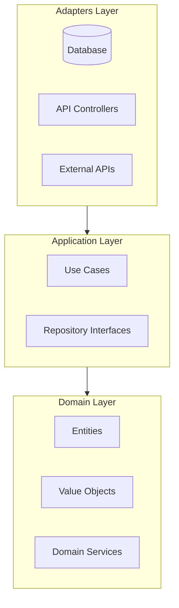

# Workflow: Create Architecture Document (Comprehensive)

<required_reading>
**Read these reference files NOW:**
1. references/methodology.md — C4 Model, arc42 sections, ADR format
2. references/domain-modeling.md — Entity extraction, aggregates, DDD patterns
3. references/clean-architecture.md — Layer definitions, dependency rule
4. references/data-api-extraction.md — **Read IF** input files include data models (SQL, Prisma, ORM) or API specs (OpenAPI, GraphQL, gRPC)
5. templates/architecture-doc-template.md — Output template to fill
</required_reading>

<context>
An Architecture Document is a **comprehensive** specification of system structure. It captures:
- **Domain Model** — Entities, value objects, aggregates, domain services
- **Architecture Layers** — How components are organized (Clean/Hexagonal/Onion)
- **Key Interfaces** — Repository interfaces, use case boundaries, APIs
- **Quality Attributes** — How NFRs map to architecture decisions
- **C4 Diagrams** — Context, Container, and optionally Component views

It is NOT decision-focused (that's a Design Doc). Focus on **structure and interfaces**.
</context>

<process>

## Phase 1: Analyze Input Files

1. Read all provided input files thoroughly
2. Create extraction notes:

**From User Stories:**
- Nouns → Entity candidates (Influencer, Campaign, Brand)
- Verbs → Use case candidates (discover, enrich, export)
- "As a [role]" → Actor identification
- Acceptance criteria → Business rules and validation

**From Requirements (SRS):**
- FR-XX → Functional capabilities
- NFR-XX → Quality attributes (performance, security, scalability)
- Constraints → Architectural constraints

**From Business Case:**
- Stakeholders → System users and personas
- Business rules → Domain logic candidates
- Success metrics → Quality requirements

**From Data Models (if provided):**
- Tables/model classes → Entity candidates (verify identity + lifecycle from requirements)
- Foreign key clusters → Aggregate boundary signals
- Enums and constrained columns → Value Object candidates
- Join tables → Relationship entities or domain services
- Indexes → Performance quality attribute signals
- See `references/data-api-extraction.md` for full extraction patterns

**From API Specifications (if provided):**
- Endpoints/operations → Use case candidates and adapter-layer interfaces
- Request schemas → Use Case Input structures
- Response schemas → Use Case Output structures; confirm entity attributes
- Auth schemes, rate limits → Security and performance quality attributes
- Endpoint groupings (tags, services) → Bounded context signals
- See `references/data-api-extraction.md` for format-specific patterns

**Reconciliation (when data models or API specs are provided):**
- Requirements take precedence over data model structure
- Flag tables/endpoints with no matching requirement as potential out-of-scope
- Flag requirements with no matching table/endpoint as new or missing implementation
- Document discrepancies in a reconciliation note for Phase 7 (Risks)

## Phase 2: Extract Domain Model

### 2.1 Identify Entities

Entities have **identity** and **lifecycle**. They are nouns that:
- Can change state over time
- Need to be uniquely identified
- Have business behavior

**Format:**
| Entity | Description | Key Attributes |
|--------|-------------|----------------|
| Influencer | A content creator on social platforms | id, name, platforms, niches |

### 2.2 Identify Value Objects

Value Objects are **immutable** concepts defined by their attributes:
- No identity (two identical VOs are the same)
- Encapsulate validation
- Examples: FollowerCount, EngagementRate, Email

### 2.3 Define Aggregates

Aggregates are **consistency boundaries**:
- One entity is the aggregate root
- All access goes through the root
- Transactions don't span aggregates

**Example:**
```
Influencer Aggregate
├── Influencer (root)
├── PlatformPresence (entity)
├── EngagementMetrics (value object)
└── ContactInfo (value object)
```

### 2.4 Identify Domain Services

Operations that don't belong to a single entity:
- Span multiple aggregates
- Require external information
- Orchestrate complex domain logic

## Phase 3: Define Architecture Layers

Use Clean Architecture pattern:

### 3.1 Domain Layer (Innermost)
- Contains: Entities, Value Objects, Domain Services
- Dependencies: **None** (pure business logic)
- No framework imports, no external dependencies

### 3.2 Application Layer
- Contains: Use Cases, Repository Interfaces
- Dependencies: Domain Layer only
- Orchestrates domain objects, defines ports

### 3.3 Adapters Layer (Outermost)
- Contains: Repository Implementations, API Controllers, UI
- Dependencies: Application + Domain Layers
- Implements interfaces defined by inner layers

### 3.4 Dependency Rule Diagram

Create a diagram showing dependencies pointing INWARD:


## Phase 4: Document Key Interfaces

### 4.1 Repository Interfaces

For each aggregate root, define a repository interface:

```python
class InfluencerRepository(Protocol):
    def find_by_id(self, id: UUID) -> Influencer | None: ...
    def search(self, criteria: SearchCriteria) -> list[Influencer]: ...
    def save(self, influencer: Influencer) -> None: ...
    def delete(self, id: UUID) -> None: ...
```

### 4.2 Use Case Interfaces

For each major operation, define input/output:

```python
@dataclass
class DiscoverInfluencersInput:
    platform: Platform
    niche: Niche
    min_followers: int

@dataclass
class DiscoverInfluencersOutput:
    influencers: list[InfluencerSummary]
    total_count: int
```

## Phase 5: Create C4 Diagrams

### 5.1 Level 1: System Context
Shows how the system fits in the world:
- The system (center)
- Users interacting with it
- External systems

### 5.2 Level 2: Container Diagram
Shows major technical building blocks:
- Web UI
- Application/API Server
- Database
- External Services

Use Mermaid C4 syntax or standard flowcharts.

## Phase 6: Map Quality Attributes

| Quality Attribute | Requirement | Architecture Decision |
|-------------------|-------------|----------------------|
| Testability | Domain tests < 100ms | Pure domain, no external deps |
| Modifiability | Swap database in < 1 day | Repository abstraction |
| Performance | Search < 500ms | Database indexing, caching |

## Phase 7: Document Constraints and Risks

**Constraints:**
- Technical constraints (platform, language)
- Organizational constraints (team size, timeline)
- External constraints (API limits, regulations)

**Risks:**
- Architecture risks
- Integration risks
- Technical debt

## Phase 8: Write Output

1. Read `templates/architecture-doc-template.md`
2. Fill in all sections with content from phases 2-7
3. Write to output location (same directory as primary input)
4. Filename: `ARCHITECTURE-DOC.md`

## Phase 9: Validate Output

Review the generated document against these checks:

1. **Placeholder check**: Search for `[` brackets — all `[placeholder]` text should be replaced with actual content
2. **Domain model completeness**:
   - At least 2 entities documented with attributes
   - At least 2 value objects with validation rules
   - At least 1 aggregate with root identified
3. **Layer coverage**: All three layers (Domain, Application, Adapters) have content
4. **Interface coverage**: Repository interface exists for each aggregate root
5. **Diagram validation**: Confirm Mermaid diagrams have valid syntax (no broken references)
6. **Quality attributes**: Each NFR from requirements maps to an architecture decision
7. **Traceability**: Domain concepts trace back to user story nouns/verbs

**If validation fails:**
- Return to the relevant phase and fix the issue
- Re-run validation after fixes
- Only mark complete when all checks pass

</process>

<success_criteria>
Architecture Document is complete when:
- [ ] Domain model has entities, value objects, and aggregates defined
- [ ] Architecture layers clearly defined with dependency rule
- [ ] Repository interfaces documented for all aggregate roots
- [ ] Use case interfaces documented for major operations
- [ ] C4 Context diagram shows system in its environment
- [ ] C4 Container diagram shows major technical blocks
- [ ] Quality attributes mapped to architecture decisions
- [ ] Constraints and risks documented
- [ ] Document is 20-40 pages (comprehensive but not bloated)
- [ ] Written to output location
</success_criteria>
