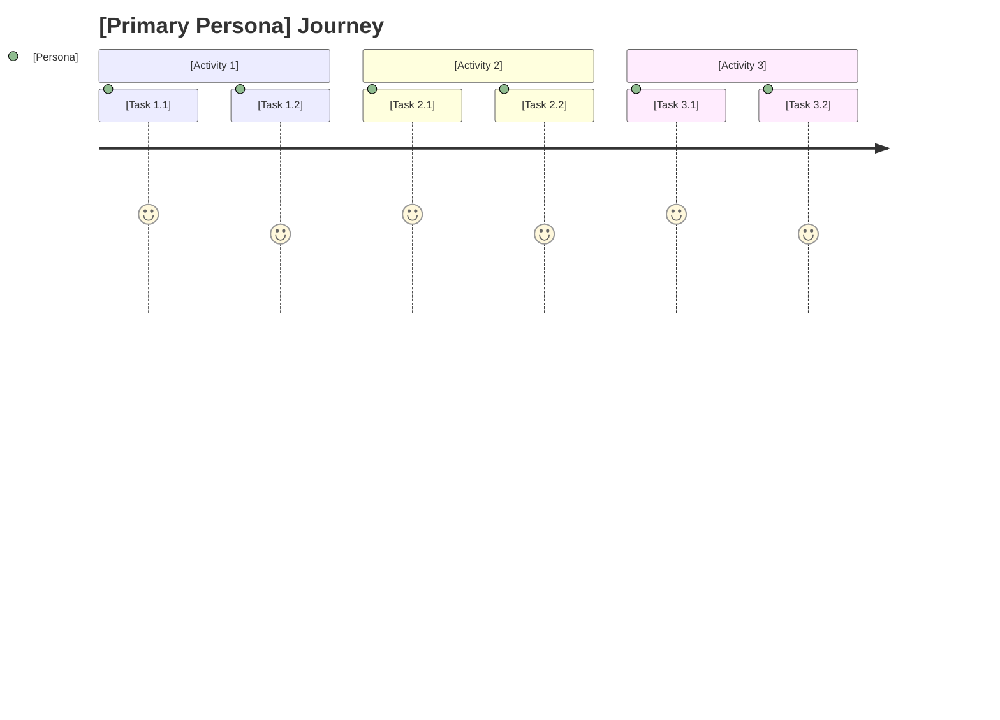

# Story Map: [Product Name]

> **Primary Persona:** [Main user role]
> **Generated from:** .charter/BUSINESS-CASE.md
> **Generated on:** [date]
> **Methodology:** Jeff Patton's User Story Mapping

---

## Quick Reference

### Release Overview

| Activity | Task | MVP | R2 | Future |
|----------|------|-----|----|----|
| **[Activity 1]** | [Task 1.1] | [Story summaries] | [Story summaries] | [Story summaries] |
| | [Task 1.2] | ... | ... | ... |
| **[Activity 2]** | [Task 2.1] | ... | ... | ... |
| | [Task 2.2] | ... | ... | ... |
| **[Activity 3]** | [Task 3.1] | ... | ... | ... |

### Release Summary

| Release | Stories | Delivers |
|---------|---------|----------|
| **MVP** | [count] | [End-to-end capability description] |
| **R2** | [count] | [Additional capabilities] |
| **Future** | [count] | [Deferred capabilities] |

---

## Visual Journey



---

## Detailed Map

### Activity 1: [Name]

**Goal:** [What the user is fundamentally trying to accomplish]
**Persona:** [Primary persona for this activity]
**Source:** BR-XX, BR-XX

#### Task 1.1: [Name]

[Brief description of what happens in this task]

| Release | Stories |
|---------|---------|
| **MVP** | • SM-001: [Story title] (BR-XX) |
| | • SM-002: [Story title] (BR-XX) |
| **R2** | • SM-010: [Story title] (BR-XX) |
| **Future** | • SM-020: [Story title] (BR-XX) |

#### Task 1.2: [Name]

[Brief description]

| Release | Stories |
|---------|---------|
| **MVP** | • SM-003: [Story title] (BR-XX) |
| **R2** | • SM-011: [Story title] (BR-XX) |

---

### Activity 2: [Name]

**Goal:** [User goal]
**Persona:** [Persona]
**Source:** BR-XX, BR-XX

#### Task 2.1: [Name]

[Brief description]

| Release | Stories |
|---------|---------|
| **MVP** | • SM-004: [Story title] (BR-XX) |
| **R2** | • SM-012: [Story title] (BR-XX) |

#### Task 2.2: [Name]

[Brief description]

| Release | Stories |
|---------|---------|
| **MVP** | • SM-005: [Story title] (BR-XX) |

---

### Activity 3: [Name]

**Goal:** [User goal]
**Persona:** [Persona]
**Source:** BR-XX

#### Task 3.1: [Name]

| Release | Stories |
|---------|---------|
| **MVP** | • SM-006: [Story title] (BR-XX) |
| **R2** | • SM-013: [Story title] (BR-XX) |

---

## Story Details

### SM-001: [Story Title]

**Source:** BR-XX (BUSINESS-CASE.md, Section 9.3)
**Activity:** [Activity name]
**Task:** [Task name]
**Release:** MVP

As a [persona],
I want [capability],
So that [benefit].

**Acceptance Criteria:**
- [ ] [Criterion 1]
- [ ] [Criterion 2]
- [ ] [Criterion 3]

---

### SM-002: [Story Title]

**Source:** BR-XX
**Activity:** [Activity name]
**Task:** [Task name]
**Release:** MVP

As a [persona],
I want [capability],
So that [benefit].

**Acceptance Criteria:**
- [ ] [Criterion 1]
- [ ] [Criterion 2]

---

[Continue for all stories...]

---

## Walking Skeleton

The walking skeleton provides end-to-end functionality with minimal features:

| Activity | Task | MVP Story | Capability |
|----------|------|-----------|------------|
| [Activity 1] | [Task 1.1] | SM-001 | [What user can do] |
| [Activity 1] | [Task 1.2] | SM-003 | [What user can do] |
| [Activity 2] | [Task 2.1] | SM-004 | [What user can do] |
| [Activity 2] | [Task 2.2] | SM-005 | [What user can do] |
| [Activity 3] | [Task 3.1] | SM-006 | [What user can do] |

**Walking skeleton delivers:** [Describe the minimal end-to-end journey]

---

## Tool Export Format

<details>
<summary>TextUSM/MarkdownUSM Format (click to expand)</summary>

```
# [Activity 1]
## [Task 1.1]
[Story 1 - MVP]
[Story 2 - MVP]
---
[Story 3 - R2]
---
[Story 4 - Future]

## [Task 1.2]
[Story 5 - MVP]
---
[Story 6 - R2]

# [Activity 2]
## [Task 2.1]
[Story 7 - MVP]
---
[Story 8 - R2]

## [Task 2.2]
[Story 9 - MVP]
---
---
[Story 10 - Future]

# [Activity 3]
## [Task 3.1]
[Story 11 - MVP]
---
[Story 12 - R2]
```

**Conversion notes:**
- `# Heading` → Activity (backbone column)
- `## Heading` → Task (grouping)
- Plain text → Story
- `---` → Move to next release column
- `---` twice → Skip a release

</details>

---

## Traceability

| Story ID | Title | BR-XX Source | Activity | Task | Release |
|----------|-------|--------------|----------|------|---------|
| SM-001 | [Title] | BR-XX | [Activity] | [Task] | MVP |
| SM-002 | [Title] | BR-XX | [Activity] | [Task] | MVP |
| SM-003 | [Title] | BR-XX | [Activity] | [Task] | MVP |
| SM-004 | [Title] | BR-XX | [Activity] | [Task] | MVP |
| SM-005 | [Title] | BR-XX | [Activity] | [Task] | MVP |
| SM-006 | [Title] | BR-XX | [Activity] | [Task] | MVP |
| SM-010 | [Title] | BR-XX | [Activity] | [Task] | R2 |
| SM-011 | [Title] | BR-XX | [Activity] | [Task] | R2 |
| SM-012 | [Title] | BR-XX | [Activity] | [Task] | R2 |
| SM-013 | [Title] | BR-XX | [Activity] | [Task] | R2 |
| SM-020 | [Title] | BR-XX | [Activity] | [Task] | Future |

---

## Cross-Cutting Concerns

These apply across all activities (from Section 7 Constraints):

| Concern | Impact | Stories Affected |
|---------|--------|------------------|
| [Constraint 1] | [How it affects the map] | All |
| [Constraint 2] | [How it affects the map] | [Specific activities] |

---

## Gaps and Questions

| Gap | Activity | Impact | Resolution |
|-----|----------|--------|------------|
| [Missing capability?] | [Where in journey] | [What breaks without it] | [TBD / Addressed by SM-XXX] |

---

## Complementary Artifacts

- **Domain-organized backlog:** Run `/create-requirements` for Epic/Feature/Story hierarchy
- **Architecture:** Run `/create-design-doc` for technical design
- **Execution plan:** Run `/create-execution-plan` for implementation phasing
