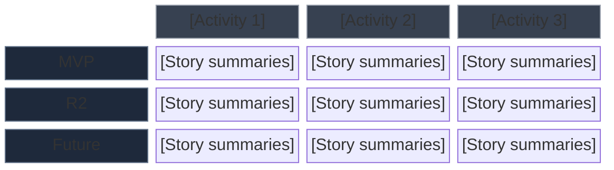

# Workflow: Create Story Map

<required_reading>
**Read this template before generating output (Phase 5):**
1. templates/story-map-template.md
</required_reading>

<phase_1_parse_and_identify_personas>
**Phase 1: Parse Business Case and Identify Personas**

**1.1 Extract Stakeholders as Personas**

From Section 4 (Stakeholders), identify user personas for the story map:
- Filter to stakeholders with Type = "User" or direct system interaction
- Each persona may have a different journey through the product

```
Persona: [Role from Section 4]
Goals: [Derived from stakeholder Needs column]
Key Activities: [Inferred from their role]
```

**1.2 Load Reference Documents**

Collect references from two sources:

1. **From Section 9.6 (automatic):** If Section 9.6 (Reference Documents) exists, collect all document paths listed in the reference table.
2. **From command arguments (explicit):** If reference documents were passed as arguments in the intake phase, add them to the collection.
3. **Merge and deduplicate:** Combine both sources. Load once if duplicated.
4. **Load all collected references:** Extract detailed specifications (data types, validation rules, thresholds, enumerations) that inform story granularity and scope decisions.

**If no references from either source:** Proceed without additional context. Stories may lack implementation-level precision.

**1.3 Extract BR-XX Requirements**

From Section 9.3, parse the requirements table:
- ID (BR-01, BR-02, ...)
- Requirement text
- Priority (Must/Should/Could)
- Acceptance Criteria

**1.4 Extract Constraints**

From Section 7, note cross-cutting concerns that apply across the map:
- Timeline constraints → Affect release slicing
- Technical constraints → May limit certain activities
- Regulatory constraints → Add compliance requirements

**1.5 Present Parsing Summary**

```
## Business Case Parsing Summary

**Personas identified:** [count] ([list roles])
**Business Requirements (BR-XX):** [count] (Must: X, Should: X, Could: X)
**Constraints:** [count] cross-cutting concerns

Ready to build story map.
```

Proceed to Phase 2.
</phase_1_parse_and_identify_personas>

<phase_2_build_backbone>
**Phase 2: Build the Backbone**

**2.1 Identify Activities (User Goals)**

Group BR-XX requirements by the user goal they serve. Ask:
- "What is the user fundamentally trying to accomplish?"
- "What major activity areas does this product support?"

Typical activity patterns:
- **Discover/Create** — Adding new data to the system
- **Search/Find** — Locating existing data
- **Evaluate/Analyze** — Assessing or comparing items
- **Act/Execute** — Taking action on items
- **Track/Monitor** — Following progress over time

**2.2 Define Tasks Under Each Activity**

For each activity, list the sequential steps a user takes:
- Tasks should read as a narrative left-to-right
- Each task is a verb phrase: "Enter query", "Apply filters", "View results"

**2.3 Validate Backbone**

Use the "tell the story" test:
- Can you walk the backbone left-to-right and tell a coherent user story?
- If stuck or confused, there's a gap—add missing tasks.

**2.4 Present Backbone for Confirmation**

```
## Proposed Backbone

Activity 1: [Name] — [Goal]
  Tasks: [Task A] → [Task B] → [Task C]

Activity 2: [Name] — [Goal]
  Tasks: [Task A] → [Task B] → [Task C]

[...]

Does this capture the user's journey? Any activities or tasks to add/remove?
```

Wait for user confirmation before proceeding.
</phase_2_build_backbone>

<phase_3_place_stories>
**Phase 3: Place Stories on the Map**

**3.1 Map BR-XX to Tasks**

For each BR-XX requirement:
1. Identify which activity it belongs to
2. Identify which task it supports
3. Create one or more user stories

**Story format (internal working format — NOT written to output):**

For each story, define internally:
- Title: short descriptive name
- Persona: from Phase 1
- Capability: from BR-XX
- Benefit: from BR-XX or Section 5
- BR-XX source

The output file uses ONLY story ID + title + BR-XX source in the Detailed Map tables. Full "As a / I want / So that" story cards are NOT included in the story map output — they belong in USER-STORIES.md from `/create-requirements`.

**3.2 Vertical Priority**

Place stories under their task in priority order (top = highest):
- Must-have (from BRD) → Top (walking skeleton candidates)
- Should-have → Middle
- Could-have → Bottom

**3.3 One BR May Spawn Multiple Stories**

If BR-XX contains multiple capabilities, create atomic stories:
```
BR-06: "searchable interface for niche, country, platform, size"
    ↓
Task: Apply filters
  - Filter by niche (Must)
  - Filter by country (Must)
  - Filter by platform (Must)
  - Filter by size bucket (Must)
  - Combined AND/OR logic (Should)
```

**3.4 Assign Story IDs**

Use format: `SM-[Activity#].[Task#]-[Seq]`
- SM-1.2-01 = Activity 1, Task 2, Story 1
- Or use simple sequential: SM-001, SM-002, ...

**3.5 Track Traceability**

Every story MUST link back to BR-XX:
```
SM-001: Filter by niche
  Source: BR-06 (BUSINESS-CASE.md, Section 9.3)
```

</phase_3_place_stories>

<phase_4_define_releases>
**Phase 4: Define Release Slices**

**4.1 Identify Walking Skeleton**

The walking skeleton is the minimal end-to-end journey. For each task:
- What is the ONE story that enables basic functionality?
- Mark these as MVP candidates

**4.2 Ask User for Release Boundaries**

Use AskUserQuestion:
```
"How many release slices do you want to define?"

Options:
- 2 releases (MVP + Future) — Simplest
- 3 releases (MVP + R2 + Future) — Recommended
- 4 releases (MVP + R2 + R3 + Future) — Detailed planning
```

**4.3 Slice Criteria**

For each release, define what "done" means:
- MVP: User can complete the core journey (walking skeleton)
- R2: Adds depth to high-value areas
- R3: Polish and differentiation
- Future: Backlog for later

**4.4 Validate Each Slice**

Each slice should:
- Deliver end-to-end user value
- Be independently deployable
- Have clear success criteria (from Section 6)

**4.5 Present Release Plan**

```
## Release Slices

**MVP (Walking Skeleton):**
[X] stories across all activities
User can: [describe end-to-end capability]

**Release 2:**
[Y] additional stories
User gains: [describe added capabilities]

**Future:**
[Z] stories deferred
Rationale: [why deferred]
```

Wait for user confirmation before generating output.
</phase_4_define_releases>

<phase_5_generate_output>
**Phase 5: Generate STORY-MAP.md**

**Read template:** `templates/story-map-template.md`

Generate a compact output file. The story map is a PLANNING artifact — it shows story placement and release slicing, NOT full story details. Full story cards with acceptance criteria belong in USER-STORIES.md (from `/create-requirements`).

**5.1 Quick Reference (Release Overview Table)**

Shows what's in each release at a glance—one row per activity/task combo.

**5.2 Visual Map (Mermaid Diagram)**

Use `block-beta` to render a 2D grid — activities across columns, releases down rows. This preserves the story map's defining characteristic: horizontal journey × vertical priority.

Do NOT use `journey` diagram type — it shows satisfaction scores per step, not release slicing or story placement. It looks like a story map but represents something fundamentally different.



Adapt the number of columns/rows to match the actual activities and release slices. Use `\n` within block labels to list multiple stories per cell. Use distinct fill colors per release row for visual differentiation (e.g., blue for MVP, green for R2, amber for R3).

**5.3 Detailed Map (Nested Sections)**

Story IDs, titles, and BR-XX sources per task. Brief task descriptions. NO full story cards — no "As a / I want / So that", no acceptance criteria checkboxes.

```markdown
## Activity 1: [Name]

**Goal:** [User goal]
**Persona:** [Primary persona]
**Source:** BR-XX, BR-XX

### Task 1.1: [Name]

[Brief description of what happens in this task]

| Release | Stories |
|---------|---------|
| **MVP** | • SM-001: [Story title] (BR-XX) |
| **R2**  | • SM-005: [Story title] (BR-XX) |
```

**5.4 Walking Skeleton Table**

Minimal MVP story per task showing end-to-end capability.

**5.5 Traceability Table**

Single compact cross-reference. Do NOT produce multiple traceability views (e.g., separate "BR-XX Coverage" table). One table is sufficient:

| Story ID | Title | BR-XX | Release |
|----------|-------|-------|---------|

After the table, add a one-line coverage summary: `**Coverage:** X/Y BR-XX requirements mapped`

**5.6 Cross-Cutting Concerns and Gaps**

From Section 7 constraints and any unresolved questions.

**What NOT to include:**
- **No Story Details section** — Full "As a / I want / So that" + acceptance criteria belong in USER-STORIES.md, not the story map
- **No Tool Export section** — TextUSM/MarkdownUSM format is a niche concern; omit from default output
- **No duplicate traceability** — One cross-reference table, not multiple orientations of the same data

Write output to `.charter/STORY-MAP.md`.

Proceed to Phase 5b.

</phase_5_generate_output>

<phase_5b_resolve_gaps>
**Phase 5b: Resolve Gaps and Questions**

During phases 1-5, gaps and unresolved questions accumulate (ambiguous requirements, missing data source decisions, unclear UX patterns, undefined taxonomies, etc.). These are written to the "Gaps and Questions" section of the output file. This phase gives the user the option to resolve them interactively before finalizing.

**5b.1 Collect Gaps**

Gather all gaps and questions identified during the mapping process into a numbered list. Each gap should have:
- A short title
- A one-sentence description of what's unclear and why it matters for implementation

**5b.2 Present Resolution Choice**

If there are gaps, use AskUserQuestion:

```
"I identified [N] gaps and questions while building the story map. How would you like to handle them?"

Options:
- "Resolve interactively" — Walk through each gap one-by-one with suggested options
- "Leave as documentation" — Keep them as-is in the Gaps and Questions section of STORY-MAP.md
```

**If "Leave as documentation":** Skip to Phase 6. The gaps remain in the output file for later resolution.

**If "Resolve interactively":**

**5b.3 Walk Through Each Gap**

For each gap, use AskUserQuestion with 2-4 concrete options based on common patterns and the project context. For example:

```
Gap: "Data source strategy"
Options:
- "Static JSON file" — Hardcode hooks in a JSON seed file, update manually
- "GitHub API at build time" — Fetch from GitHub repos during next build, static at runtime
- "Runtime API fetch" — Query GitHub API on page load (rate limits apply)
```

Each question should offer actionable choices, not open-ended prompts. The options should reflect realistic trade-offs informed by the project's constraints.

**5b.4 Update Story Map**

After resolving gaps:
1. Update the "Gaps and Questions" section in `.charter/STORY-MAP.md`:
   - Move resolved gaps to a "Resolved" subsection with the chosen answer
   - Keep unresolved gaps (if the user skipped any) in the original section
2. If any resolution changes the story map itself (e.g., a resolved gap adds a new story, changes a task, or affects release slicing), update the affected sections of the output file accordingly

</phase_5b_resolve_gaps>

<phase_6_completion>
**Phase 6: Completion**

**6.1 Confirm Output**

```
Story map generation complete.

**File written:** .charter/STORY-MAP.md

**Map Structure:**
- Activities: [count]
- Tasks: [count]
- Stories: [count] (MVP: X, R2: Y, Future: Z)

**Coverage:**
- [X]/[Y] BR-XX requirements mapped
- All stories traceable to source

**Walking Skeleton:** [count] stories provide end-to-end journey
```

**6.2 Offer Next Steps**

"Would you like to:
1. Adjust release boundaries?
2. Add missing activities or tasks?
3. Generate `/create-requirements` output as well (complementary backlog)?
4. Proceed to `/create-design-doc`?"

</phase_6_completion>
