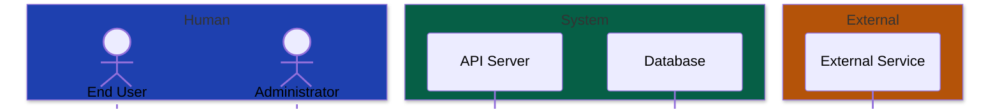

<overview>
Color palettes based on Material Design 3 (MD3) provide WCAG-compliant contrast for both light and dark themes. All values are hex codes - never use color names in Mermaid.
</overview>

<critical_rule>
**Always use hex colors.** `fill:#1976D2` works everywhere. `fill:blue` fails on GitHub.
</critical_rule>

<dark_theme>
## Dark Theme (Default)

```
ACTORS / PRIMARY ELEMENTS
  fill: #004A77
  stroke: #8ECAE6
  color: #C2E7FF

PRIMARY CONTAINERS
  fill: #004A77
  stroke: #90CAF9
  color: #C2E7FF

SECONDARY ELEMENTS
  fill: #4A4458
  stroke: #CCC2DC
  color: #E8DEF8

SUCCESS (Green-Teal)
  fill: #005141
  stroke: #6FF2CA
  color: #6FF2CA

WARNING (Amber)
  fill: #5C3D00
  stroke: #FFB95A
  color: #FFB95A

ERROR (Red)
  fill: #8C1D18
  stroke: #FFB4AB
  color: #FFB4AB

NEUTRAL / GROUPS
  fill: #2D2D2D
  stroke: #938F99
  color: #E6E1E5

BACKGROUND
  #1C1B1F
```

**Copy-paste classDef for dark theme:**
```mermaid
classDef primary fill:#004A77,stroke:#8ECAE6,color:#C2E7FF
classDef secondary fill:#4A4458,stroke:#CCC2DC,color:#E8DEF8
classDef success fill:#005141,stroke:#6FF2CA,color:#6FF2CA
classDef warning fill:#5C3D00,stroke:#FFB95A,color:#FFB95A
classDef error fill:#8C1D18,stroke:#FFB4AB,color:#FFB4AB
classDef neutral fill:#2D2D2D,stroke:#938F99,color:#E6E1E5
```
</dark_theme>

<light_theme>
## Light Theme

```
ACTORS / PRIMARY ELEMENTS
  fill: #1976D2
  stroke: #0D47A1
  color: #FFFFFF

PRIMARY CONTAINERS
  fill: #BBDEFB
  stroke: #1976D2
  color: #0D47A1

SECONDARY ELEMENTS
  fill: #E8DEF8
  stroke: #625B71
  color: #1E192B

SUCCESS (Green-Teal)
  fill: #9EF2DE
  stroke: #006B5B
  color: #00201A

WARNING (Amber)
  fill: #FFE082
  stroke: #F9A825
  color: #5C3D00

ERROR (Red)
  fill: #F9DEDC
  stroke: #B3261E
  color: #410E0B

NEUTRAL / GROUPS
  fill: #F5F5F5
  stroke: #79747E
  color: #49454F

BACKGROUND
  #FFFBFE
```

**Copy-paste classDef for light theme:**
```mermaid
classDef primary fill:#1976D2,stroke:#0D47A1,color:#FFFFFF
classDef secondary fill:#E8DEF8,stroke:#625B71,color:#1E192B
classDef success fill:#9EF2DE,stroke:#006B5B,color:#00201A
classDef warning fill:#FFE082,stroke:#F9A825,color:#5C3D00
classDef error fill:#F9DEDC,stroke:#B3261E,color:#410E0B
classDef neutral fill:#F5F5F5,stroke:#79747E,color:#49454F
```
</light_theme>

<semantic_mapping>
## Semantic Color Usage (Basic)

| Element Type | Color Class | Example Use |
|--------------|-------------|-------------|
| Primary actors, main systems | primary | User, Main App, Core Service |
| Supporting systems, external | secondary | Third-party API, Helper Service |
| Success paths, positive outcomes | success | Payment Complete, Validation Passed |
| Warnings, attention needed | warning | Retry, Rate Limited |
| Errors, failures | error | Failed, Timeout, Exception |
| Groups, subgraphs, neutral | neutral | Subsystem boundary, Category |
</semantic_mapping>

<semantic_color_strategies>
## Semantic Color Strategies

**IMPORTANT:** Before applying colors, ASK the user which semantic strategy to use. Colors should encode MEANING, not just look pretty.

### Strategy 1: By Domain/Feature Area (Recommended for SRS, architecture docs)

Group elements by functional domain. Each domain gets a distinct color.

```mermaid
%% Example domain palette (Tailwind-inspired, vibrant)
classDef discovery fill:#1E40AF,stroke:#60A5FA,stroke-width:1px,color:#DBEAFE
classDef search fill:#6D28D9,stroke:#A78BFA,stroke-width:1px,color:#EDE9FE
classDef outreach fill:#0F766E,stroke:#2DD4BF,stroke-width:1px,color:#CCFBF1
classDef review fill:#B45309,stroke:#FBBF24,stroke-width:1px,color:#FEF3C7
classDef analytics fill:#BE185D,stroke:#F472B6,stroke-width:1px,color:#FCE7F3
```

**When to use:** Requirements docs, feature planning, architecture with multiple subsystems.

### Strategy 2: By Priority (MoSCoW)

Show what's essential vs optional at a glance.

```mermaid
%% Priority palette
classDef must fill:#991B1B,stroke:#F87171,stroke-width:2px,color:#FEE2E2
classDef should fill:#B45309,stroke:#FBBF24,stroke-width:1px,color:#FEF3C7
classDef could fill:#1E40AF,stroke:#60A5FA,stroke-width:1px,color:#DBEAFE
classDef wont fill:#374151,stroke:#6B7280,stroke-width:1px,color:#D1D5DB
```

**When to use:** MVP scoping, stakeholder presentations, roadmap planning.

### Strategy 3: By Actor/Owner

Show who is responsible for what.

```mermaid
%% Actor palette (assign colors to roles)
classDef admin fill:#7C3AED,stroke:#A78BFA,stroke-width:1px,color:#EDE9FE
classDef user fill:#0369A1,stroke:#38BDF8,stroke-width:1px,color:#E0F2FE
classDef system fill:#065F46,stroke:#34D399,stroke-width:1px,color:#D1FAE5
classDef external fill:#92400E,stroke:#FBBF24,stroke-width:1px,color:#FEF3C7
```

**When to use:** Access control diagrams, responsibility matrices, role-based workflows.

### Strategy 4: By State/Status

Show implementation or lifecycle status.

```mermaid
%% Status palette
classDef done fill:#065F46,stroke:#34D399,stroke-width:1px,color:#D1FAE5
classDef inprogress fill:#B45309,stroke:#FBBF24,stroke-width:1px,color:#FEF3C7
classDef planned fill:#1E40AF,stroke:#60A5FA,stroke-width:1px,color:#DBEAFE
classDef blocked fill:#991B1B,stroke:#F87171,stroke-width:1px,color:#FEE2E2
```

**When to use:** Progress tracking, project status dashboards, migration planning.

### Asking the User

Before applying colors, ask:
"What should the colors communicate?"
1. **Domain/Feature area** - Group by functional area (Discovery, Search, etc.)
2. **Priority** - Must/Should/Could importance levels
3. **Actor/Owner** - Who is responsible for each element
4. **Status** - Implementation state (Done, In Progress, Planned)
5. **None** - Just use primary/secondary for visual variety
</semantic_color_strategies>

<vibrant_palette>
## Vibrant Palette (Tailwind-Inspired)

When the MD3 palette looks too muted, use these Tailwind-based colors for more visual impact while maintaining accessibility.

```mermaid
%% Vibrant dark theme - Tailwind colors
classDef blue fill:#1E40AF,stroke:#60A5FA,stroke-width:1px,color:#DBEAFE
classDef purple fill:#6D28D9,stroke:#A78BFA,stroke-width:1px,color:#EDE9FE
classDef teal fill:#0F766E,stroke:#2DD4BF,stroke-width:1px,color:#CCFBF1
classDef amber fill:#B45309,stroke:#FBBF24,stroke-width:1px,color:#FEF3C7
classDef rose fill:#BE185D,stroke:#F472B6,stroke-width:1px,color:#FCE7F3
classDef emerald fill:#065F46,stroke:#34D399,stroke-width:1px,color:#D1FAE5
classDef red fill:#991B1B,stroke:#F87171,stroke-width:1px,color:#FEE2E2
classDef slate fill:#1E293B,stroke:#64748B,stroke-width:1px,color:#F1F5F9
```

**Neutral elements (actors, boundaries):**
```mermaid
classDef actor fill:#1E293B,stroke:#64748B,stroke-width:2px,color:#F1F5F9
classDef boundary fill:none,stroke:#475569,stroke-width:1px,stroke-dasharray:5 5,color:#CBD5E1
```

**Link styling:**
```mermaid
linkStyle default stroke:#64748B,stroke-width:1px
```
</vibrant_palette>

<theme_init>
## Theme Configuration (init directive)

For global theming, use the init directive at the start of the diagram:

**Dark theme:**
```mermaid
%%{init: {
  'theme': 'dark',
  'themeVariables': {
    'primaryColor': '#004A77',
    'primaryTextColor': '#C2E7FF',
    'primaryBorderColor': '#8ECAE6',
    'lineColor': '#8ECAE6',
    'secondaryColor': '#4A4458',
    'tertiaryColor': '#005141',
    'background': '#1C1B1F',
    'mainBkg': '#1C1B1F',
    'textColor': '#E6E1E5'
  }
}}%%
```

**Light theme:**
```mermaid
%%{init: {
  'theme': 'base',
  'themeVariables': {
    'primaryColor': '#BBDEFB',
    'primaryTextColor': '#0D47A1',
    'primaryBorderColor': '#1976D2',
    'lineColor': '#1976D2',
    'secondaryColor': '#E8DEF8',
    'tertiaryColor': '#9EF2DE',
    'background': '#FFFBFE',
    'mainBkg': '#FFFBFE',
    'textColor': '#1C1B1F'
  }
}}%%
```
</theme_init>

<builtin_themes>
## Mermaid Built-in Themes

| Theme | Best For |
|-------|----------|
| `default` | General light mode |
| `dark` | Dark mode (basic) |
| `neutral` | Print/grayscale |
| `forest` | Green aesthetic |
| `base` | Custom theming only |

Use `base` with themeVariables for full control.
</builtin_themes>

<sequence_diagram_colors>
## Sequence Diagram Colors (Box Syntax)

Sequence diagrams **do NOT support `classDef`**. Use the `box rgb(r, g, b) Label` syntax instead.

**IMPORTANT:** Use RGB values (0-255), NOT hex codes in box syntax.

### Actor Type Palette (Recommended for Sequences)

Group participants by type, not domain:



### RGB Values Reference

| Actor Type | RGB Value | Hex Equivalent | Visual |
|------------|-----------|----------------|--------|
| Human | `rgb(30, 64, 175)` | #1E40AF | Blue |
| System | `rgb(6, 95, 70)` | #065F46 | Emerald |
| External | `rgb(180, 83, 9)` | #B45309 | Amber |
| Admin/Elevated | `rgb(109, 40, 217)` | #6D28D9 | Purple |
| Error/Alert | `rgb(153, 27, 27)` | #991B1B | Red |

### Converting Hex to RGB

To convert Tailwind hex colors to RGB for box syntax:
- `#1E40AF` → `rgb(30, 64, 175)` (blue-700)
- `#065F46` → `rgb(6, 95, 70)` (emerald-800)
- `#B45309` → `rgb(180, 83, 9)` (amber-700)
- `#6D28D9` → `rgb(109, 40, 217)` (purple-700)
- `#991B1B` → `rgb(153, 27, 27)` (red-800)

### Legend for Sequence Diagrams

```markdown
**Legend:** 🔵 Human (Data Collector) · 🟢 System (Boom) · 🟠 External (Respond.io, Influencer)
```
</sequence_diagram_colors>
