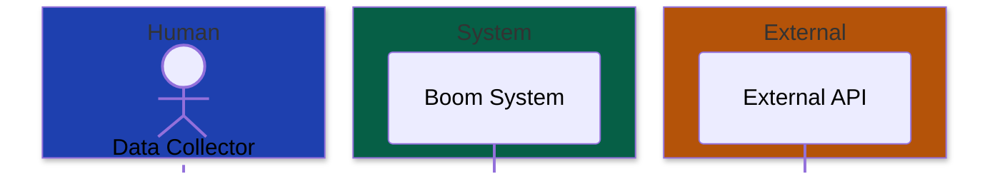

# Workflow: Create Diagram

<required_reading>
**Read these reference files NOW before creating:**
1. references/diagram-selection.md (if type not specified)
2. references/color-palettes.md (for theme colors)
3. references/platform-compatibility.md (for target platform rules)
</required_reading>

<process>

<step name="1-confirm-parameters">
## Step 1: Confirm Parameters

Ensure you have:
- **Type**: Diagram type (c4-context, flowchart, sequence, etc.)
- **Theme**: dark (default) or light
- **Target**: github (default) or vscode
- **Subject**: What to diagram (from context or user input)

If type is ambiguous, use decision logic from `references/diagram-selection.md`:
- Architecture overview → C4 Context
- Service breakdown → C4 Container
- Step-by-step process → Flowchart
- API/object interactions → Sequence
- Database tables → ER
- Object lifecycle → State

**Confirm with user before proceeding:**
"I'll create a [type] diagram for [subject] using [theme] theme for [target]. Proceed?"
</step>

<step name="2-gather-elements">
## Step 2: Gather Diagram Elements

From the conversation context or by asking, identify:

**For C4 diagrams:**
- Actors (users, external systems)
- Containers (apps, databases, services)
- Relationships (what calls what, data flow)

**For Flowcharts:**
- Start/end points
- Decision points (diamonds)
- Process steps (rectangles)
- Flow direction (LR or TB)

**For Sequence diagrams:**
- Participants (actors, systems)
- Messages (requests, responses)
- Timing (order matters)

**For ER diagrams:**
- Entities (tables)
- Attributes (columns)
- Relationships (1:1, 1:N, N:M)

**For State diagrams:**
- States
- Transitions (events that cause state changes)
- Initial and final states

**Complexity check:** If >15 elements identified, discuss splitting with user.
</step>

<step name="2b-design-decisions">
## Step 2b: Design Decisions (CRITICAL)

Before generating, make deliberate design choices. Don't skip this - it's the difference between dull and beautiful diagrams.

### Shape Selection

| Element Type | Shape | Mermaid Syntax | Visual Effect |
|--------------|-------|----------------|---------------|
| Actors/People | Stadium (rounded) | `([Actor Name])` | Soft, human |
| Process/Action | Rectangle | `[Action Name]` | Structured, system |
| Decision | Diamond | `{Decision?}` | Branching logic |
| Data/Document | Parallelogram | `[/Data/]` | Flow of information |
| Database | Cylinder | `[(Database)]` | Storage |

**Rule:** Different element types should have different shapes for visual distinction.

### Label Refinement

Shorten verbose labels. Technical diagrams are not prose.

| Before | After |
|--------|-------|
| "View Discovery Progress" | "View Progress" |
| "Search & Filter Influencers" | "Search & Filter" |
| "Configure Discovery Parameters" | "Configure Params" |

**Rule:** 2-3 words max per label. If you need more, the concept needs splitting.

### Semantic Color Strategy

**ASK THE USER** which color strategy to use (from `references/color-palettes.md`):

"What should the colors communicate?"
1. **Domain/Feature** - Group by functional area (e.g., Discovery=blue, Search=purple)
2. **Priority** - Must/Should/Could importance levels
3. **Actor/Owner** - Who is responsible for each element
4. **Status** - Implementation state (Done, Planned, Blocked)
5. **None** - Just primary/secondary for visual variety

**Default:** If user doesn't care, use **Domain/Feature** for requirements docs, **Priority** for roadmaps.

### Boundary Styling

System boundaries should **recede**, not dominate.

```mermaid
%% Good: Subtle dashed boundary
classDef boundary fill:none,stroke:#475569,stroke-width:1px,stroke-dasharray:5 5,color:#CBD5E1

%% Bad: Heavy solid boundary that competes with content
classDef boundary fill:#2D2D2D,stroke:#938F99,stroke-width:2px,color:#E6E1E5
```

### Link/Arrow Styling

Don't leave default black arrows. Style them to match the theme.

```mermaid
linkStyle default stroke:#64748B,stroke-width:1px
```

### Smooth Curves

Add `"curve": "basis"` to the init directive for modern, smooth arrows.

```mermaid
%%{init: {"flowchart": {"nodeSpacing": 30, "rankSpacing": 60, "curve": "basis"}} }%%
```

### Spacing Behavior (Counterintuitive!)

**IMPORTANT:** `nodeSpacing` and `rankSpacing` swap their visual effect based on layout direction:

| Layout | nodeSpacing controls | rankSpacing controls |
|--------|---------------------|---------------------|
| **LR/RL** | **Vertical** gap between nodes | Horizontal gap between ranks |
| **TD/BT** | Horizontal gap between nodes | **Vertical** gap between ranks |

**Common mistake:** Increasing `nodeSpacing` to spread nodes horizontally in LR mode — but it actually increases *vertical* gaps.

**Practical guidance:**
- For **more vertical breathing room** in LR: increase `nodeSpacing` (e.g., 60-150)
- For **more horizontal spread** in LR: increase `rankSpacing`
- Default values: both are 50

### Layout Direction (LR vs TD)

Choose layout based on the **longest sequential chain** (number of ranks):

| Longest Chain | Recommended Layout | Reason |
|---------------|-------------------|--------|
| ≤5 steps | LR (left-to-right) | Fits horizontally, reduces vertical scroll |
| >5 steps | TD (top-down) | LR would compress too much horizontally |

**Example:** A BPMN with 6-step process chains → use TD.

### Line Breaks in Labels

**Use `<br/>` for line breaks, NOT `\n`.**

```mermaid
%% WRONG - renders literally as "\n"
Decision{Database\nExists?}

%% CORRECT - renders as two lines
Decision{Database<br/>Exists?}
```

### Subgraph Labels vs Node Labels

- **Node labels**: 2-3 words max (concise)
- **Subgraph labels**: Can be descriptive ("Current State (Manual)", "Pre-Built Database (This Project)")

Subgraph labels provide context that helps readers understand the diagram structure.

### Legend

If using semantic colors, add a legend below the diagram:

```markdown
**Legend:** 🔵 Discovery · 🟣 Search · 🟠 Review · 🩵 Outreach · 🩷 Analytics
```

### Sequence Diagram Styling (DIFFERENT FROM FLOWCHARTS)

Sequence diagrams **do NOT support `classDef`**. Use these alternatives:

**1. Use `box` syntax for colored participant groupings:**


**2. Group by actor TYPE, not domain:**
- **Human** actors → Blue `rgb(30, 64, 175)`
- **System** participants → Emerald `rgb(6, 95, 70)`
- **External** services → Amber `rgb(180, 83, 9)`

**3. Prevent duplicate actors at bottom:**
```mermaid
%%{init: {"sequence": {"mirrorActors": false}} }%%
```

**4. UML constructs for branching:**
- `alt`/`else` for conditional paths (if/else)
- `loop` for repeated actions
- `opt` for optional actions
- `Note right of X:` for annotations

**GitHub compatibility:** The `box rgb()` syntax works on GitHub (~v10.8.0).

### State Diagram Layout

For state diagrams with many bidirectional transitions:
- **Use TD (top-down)** layout instead of LR
- LR compresses horizontally when states have multiple incoming/outgoing edges
- TD gives better visual spacing for complex state machines

```mermaid
%%{init: {"stateDiagram": {"nodeSpacing": 60, "rankSpacing": 40}} }%%
stateDiagram-v2
    direction TB
```
</step>

<step name="3-get-syntax">
## Step 3: Get Current Mermaid Syntax

Query Context7 for the specific diagram type syntax:

```
mcp__context7__query-docs
libraryId: /mermaid-js/mermaid
query: "[diagram type] syntax examples"
```

**Critical:** Don't guess syntax. Mermaid versions change. Verify arrow types, keywords, and structure.
</step>

<step name="4-apply-styling">
## Step 4: Apply Theme Colors

From `references/color-palettes.md`, apply the selected theme.

**Dark theme (default):**
```
Primary: fill:#004A77, stroke:#8ECAE6, color:#C2E7FF
Secondary: fill:#4A4458, stroke:#CCC2DC, color:#E8DEF8
Success: fill:#005141, stroke:#6FF2CA, color:#6FF2CA
Warning: fill:#5C3D00, stroke:#FFB95A, color:#FFB95A
Error: fill:#8C1D18, stroke:#FFB4AB, color:#FFB4AB
Neutral: fill:#2D2D2D, stroke:#938F99, color:#E6E1E5
```

**Light theme:**
```
Primary: fill:#1976D2, stroke:#0D47A1, color:#FFFFFF
Secondary: fill:#E8DEF8, stroke:#625B71, color:#1E192B
Success: fill:#9EF2DE, stroke:#006B5B, color:#00201A
Warning: fill:#FFE082, stroke:#F9A825, color:#5C3D00
Error: fill:#F9DEDC, stroke:#B3261E, color:#410E0B
Neutral: fill:#F5F5F5, stroke:#79747E, color:#49454F
```

**Apply semantic meaning:**
- Actors/primary elements → Primary colors
- Supporting systems → Secondary colors
- Success paths → Success colors
- Error paths → Error colors
- Grouping/subgraphs → Neutral colors
</step>

<step name="5-generate-diagram">
## Step 5: Generate Diagram

Write the Mermaid code block:

**For flowcharts** (use LR layout and nodeSpacing for readability):
```mermaid
%%{init: {"flowchart": {"nodeSpacing": 200}} }%%
flowchart LR
    [elements and relationships]
    [styling]
```

**For other diagram types:**
```mermaid
[diagram type declaration]
[elements and relationships]
[styling with classDef if needed]
```

**Layout guidance:**
- **LR (left-to-right)**: Default for flowcharts - reduces vertical scrolling
- **TD (top-down)**: Use when vertical flow is more intuitive (e.g., org charts)

**Spacing (counterintuitive naming!):**
| Mode | nodeSpacing controls | rankSpacing controls |
|------|---------------------|---------------------|
| LR/RL | **Vertical** gap | Horizontal gap |
| TB/BT | Horizontal gap | **Vertical** gap |

- For **compact vertical** in LR: use low `nodeSpacing` (e.g., 30-50)
- For **spread out vertical** in LR: use high `nodeSpacing` (e.g., 150-200)
- Default values: both are 50

**SVG scaling effect (critical for consistent appearance):**
Mermaid renders diagrams at natural size, then the viewer scales to fit container width:
- **Wider** diagram (high `rankSpacing` or many ranks) → scales **down** more → smaller fonts/nodes
- **Narrower** diagram (low `rankSpacing` or few ranks) → scales **down** less → larger fonts/nodes

**To match apparent size across different diagram topologies:**
- Long chain diagrams (many ranks): reduce `rankSpacing` to make narrower → scales up
- Hub-and-spoke diagrams (few ranks): increase `rankSpacing` to make wider → scales down to match

**Platform rules (from references/platform-compatibility.md):**

For GitHub target:
- No click events
- No custom fonts
- Use hex colors only
- Keep under 30 nodes
- Avoid quadrantChart and xychart-beta

For VSCode target:
- All features available
- Can use click events with `securityLevel: loose`
- Export to image supported
</step>

<step name="6-validate">
## Step 6: Validate

Before presenting to user, check:

- [ ] First line is correct diagram type declaration
- [ ] All brackets/parentheses closed
- [ ] Arrow syntax matches diagram type
- [ ] Only hex colors used (no color names)
- [ ] Node count ≤15 (or discussed with user)
- [ ] Labels are clear (nouns for nodes, verbs for edges)

**If GitHub target, also verify:**
- [ ] No click events
- [ ] No unsupported diagram types
</step>

<step name="7-present">
## Step 7: Present and Offer Iterations

Present the diagram and ask:
"Here's the [type] diagram. Would you like to:
1. Add more detail
2. Change the theme
3. Split into multiple diagrams
4. Export to image (requires CLI)
5. Done"

If user requests changes → route to `workflows/iterate-diagram.md`
</step>

</process>

<anti_patterns>
Avoid:
- Generating diagram without confirming type first
- Using color names instead of hex values
- Creating >25 node diagrams without splitting
- Guessing Mermaid syntax instead of querying Context7
- Using click events for GitHub target
- Skipping the validation step
</anti_patterns>

<success_criteria>
Diagram creation is complete when:
- [ ] Renders without errors on target platform
- [ ] Correct diagram type for communication goal
- [ ] Theme colors applied consistently
- [ ] ≤15 nodes (or user-approved exception)
- [ ] Clear, readable labels
- [ ] User confirms it meets their need
</success_criteria>
