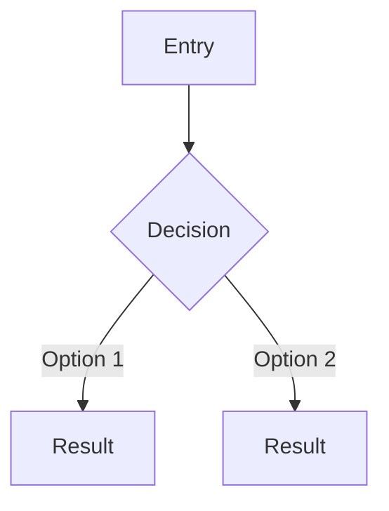

# UX Design Plan — [Product Name]

> **Generated from:** [Story Map path] | [User Stories path or "not provided"]
> **Scope:** [Release slice, e.g., "MVP"]
> **Date:** [Generation date]

---

## Section 1: Overview & Design Principles

**Product summary:** [1-2 sentences derived from story map — what is this product and who is it for]

**Guiding UX principles** (3-5, specific to this product — NOT generic heuristics):

1. **[Principle name]** — [Why this principle matters for this product's users]
2. **[Principle name]** — [Why this principle matters for this product's users]
3. **[Principle name]** — [Why this principle matters for this product's users]

---

## Section 2: Information Architecture

### Page Inventory

| Page ID | Page Name | Source Activity | Page Type | Nav Level |
|---------|-----------|-----------------|-----------|-----------|
| PG-001 | [name] | SM-XXX | [listing/detail/form/dashboard/landing] | [primary/secondary/utility] |

### Navigation Model

**Primary model:** [flat / hierarchical / hub-and-spoke / filtered-view / sequential]

[Description of how pages connect, entry/exit points, deep linking strategy]

### Content Hierarchy

[Per-page content priority stacking: P1 (primary) through P4 (ambient)]

---

## Section 3: Visual Hierarchy Map

| Rank | Element Name | Type Role | Emphasis | Container |
|------|-------------|-----------|----------|-----------|
| 1 | [e.g., page-title] | [e.g., display] | [high/medium/low] | [page-level] |
| 2 | [e.g., section-title] | [e.g., heading-2] | [high] | [section] |
| ... | ... | ... | ... | ... |

**Scanning pattern per page:**

- **[Page Name]**: [F-pattern / Z-pattern / layer-cake] — [content-to-zone mapping]

---

## Section 4: Page Layouts

### [Page Name] (PG-XXX)

**Base tier (mobile):**
```
[Text-based wireframe showing content zones, element order, spatial relationships]
[Use abstract spacing: XS, S, M, L, XL]
```

**Tablet adds:** [what changes]
**Desktop adds:** [what changes]

[Repeat for each page]

---

## Section 5: Component Specifications

### Atoms

#### [Component Name] — Atom

**Purpose:** [What it does, traced to SM-XXX / US-XXX]

| State | Visual Description | Behavior |
|-------|-------------------|----------|
| Default | [appearance at rest] | [user affordance] |
| Hover | [emphasis change] | [feedback] |
| Focus | [focus ring, 3:1 contrast] | [keyboard interaction] |
| Active | [pressed appearance] | [action result] |

**Accessibility:** [Semantic HTML element, ARIA, keyboard behavior]

### Molecules

#### [Component Name] — Molecule

**Composition:** [Which atoms compose this molecule]
**Purpose:** [Traced to SM-XXX / US-XXX]

| State | Visual Description | Behavior |
|-------|-------------------|----------|
| ... | ... | ... |

**Accessibility:** [Semantic HTML, ARIA, keyboard]

### Organisms

#### [Component Name] — Organism

**Composition:** [Which molecules/atoms compose this organism]
**Purpose:** [Traced to SM-XXX / US-XXX]

| State | Visual Description | Behavior |
|-------|-------------------|----------|
| ... | ... | ... |

**Accessibility:** [Semantic HTML, ARIA, keyboard, focus management]

---

## Section 6: Interaction Patterns

### [Component/Interaction Name]

- **Trigger:** [user action or system event]
- **Response:** [what changes in the UI]
- **Feedback model:** [optimistic / pessimistic]
- **Animation:** [duration category] + [easing]
- **Keyboard:** [Tab, Enter/Space, Escape behavior]
- **Mobile variant:** [touch target, gesture differences]
- **Reduced motion:** [fallback behavior]
- **Source:** SM-XXX / US-XXX

[Repeat for each interactive element. Filter interactions get expanded specification: placement, application method, boolean logic, clear/reset, no-results, URL persistence.]

---

## Section 7: Responsive Behavior

### Breakpoint Strategy

| Tier | Description | Touch Model |
|------|-------------|-------------|
| Mobile | Single-column, portrait | Touch-primary, 44x44 min targets |
| Tablet | Multi-column possible | Touch-primary, 44x44 min targets |
| Desktop | Full multi-column | Pointer-primary, 24x24 min targets |

### Per-Component Responsive Specs

#### [Component Name]

| Aspect | Mobile | Tablet | Desktop |
|--------|--------|--------|---------|
| Layout | [description] | [description] | [description] |
| Navigation | [model] | [model] | [model] |
| Content visibility | [what's visible] | [what's added] | [what's added] |
| Typography scale | [tier ratio] | [tier ratio] | [tier ratio] |

**Transformation pattern:** [column-drop / stack / collapse / replace / hide / reposition]

---

## Section 8: Data States

### [Component Name] — Data States

| State | Pattern | Content |
|-------|---------|---------|
| Loading | [skeleton / spinner / none] | [what appears, render delay threshold] |
| Empty | [type: first-use / no-data / no-results] | **Headline:** "[exact text]" **Body:** "[exact text]" **CTA:** "[exact label]" |
| Error | [inline / banner / page] | **Message:** "[what + why + recovery action]" |
| Success | [none / inline / toast / banner] | "[exact confirmation text]" |
| Partial | [hide / degrade / replace] | [strategy for mixed success/failure] |

[Repeat for every data-dependent component]

---

## Section 9: Accessibility

### Global Requirements

- Skip link: "Skip to main content" as first focusable element
- Landmark regions: `<nav>`, `<main>`, `<footer>` with `aria-label`
- Heading hierarchy: No skipped levels; visual size via CSS only
- Focus indicators: 3:1 contrast minimum, visible on all interactive elements
- Color independence: No information conveyed through color alone
- Text resize: All content accessible at 200% zoom without horizontal scroll

### Per-Component Accessibility

#### [Component Name]

- **HTML element:** [e.g., `<article>` in `<ul>`]
- **ARIA:** [roles, states, properties]
- **Keyboard:** [interaction model]
- **Focus pattern:** [trap / roving tabindex / return]
- **Accessible name:** [visible text / aria-label / aria-labelledby]
- **Live region:** [aria-live level, if dynamic]
- **Touch target:** [minimum size at touch tiers]

---

## Section 10: User Flows

### Flow: [Task Name] (from SM-XXX)

**Entry point:** [How user starts this task]

1. [Step] -> [UI response]
2. [Step] -> [UI response]
   - **If [condition]:** [branch path]
   - **If error:** [recovery path]
3. [Step] -> [UI response]

**Exit point:** [Where user ends up]

[Mermaid diagram for complex branching flows:]



---

## Section 11: Traceability Matrix

| UX Element | Plan Section | Source ID | Source Description |
|------------|-------------|-----------|-------------------|
| [element] | [section ref] | SM-XXX / US-XXX | [activity/story name] |

### Coverage Summary

- **Story map activities in scope:** [N]
- **Activities with UX coverage:** [N] ([%])
- **Gaps:** [List any uncovered activities]

### Nielsen's Heuristic Validation Summary

| Heuristic | Status | Notes |
|-----------|--------|-------|
| H1: Visibility of system status | [Pass/Warn/Fail] | [Brief note] |
| H2: Match between system and real world | [Pass/Warn/Fail] | [Brief note] |
| H3: User control and freedom | [Pass/Warn/Fail] | [Brief note] |
| H4: Consistency and standards | [Pass/Warn/Fail] | [Brief note] |
| H5: Error prevention | [Pass/Warn/Fail] | [Brief note] |
| H6: Recognition rather than recall | [Pass/Warn/Fail] | [Brief note] |
| H7: Flexibility and efficiency of use | [Pass/Warn/Fail] | [Brief note] |
| H8: Aesthetic and minimalist design | [Pass/Warn/Fail] | [Brief note] |
| H9: Help users recognize, diagnose, recover from errors | [Pass/Warn/Fail] | [Brief note] |
| H10: Help and documentation | [Pass/Warn/Fail] | [Brief note] |
